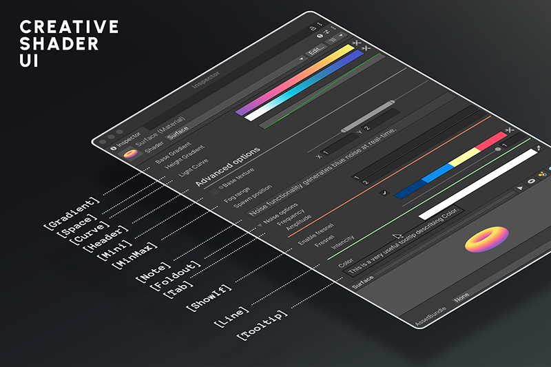
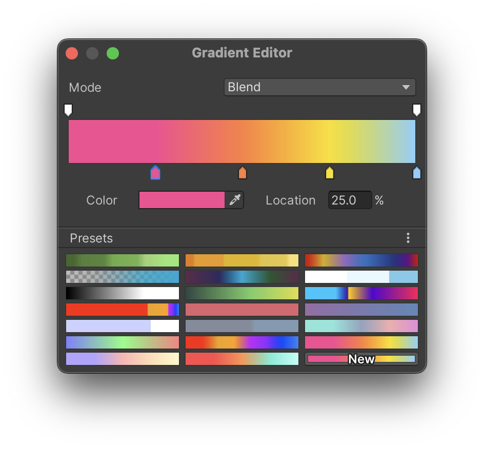
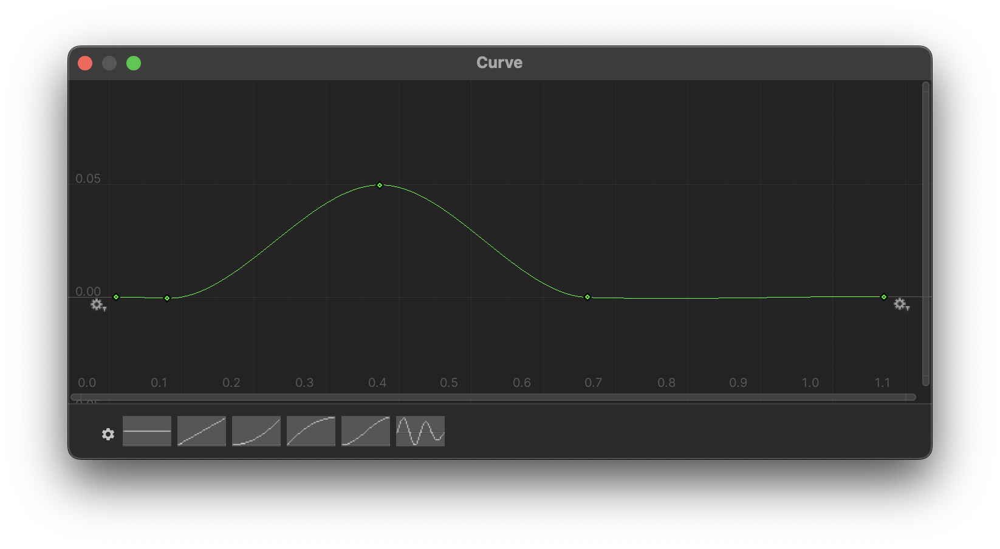

<!--
**[Full documentation online](https://chroma.dustyroom.com)** We strongly encourage you to read the documentation online. It is much more readable and contains more information than this page.
{: .notice--warning}
-->

## Brief Overview
Chroma is a custom shader UI for Unity that allows you to add *gradients* and *curves* to any shader as parameters, unlocking shaders that are much more visually appealing and dynamic than what is possible with the default UI. Plus, with Chroma you can create super intuitive, user-friendly material inspectors by adding things like tooltips, notes, foldouts, and more.

Main features:
- **[Gradient](/gradient) and [curve](/curve) parameters** allow you to create shaders that are much more visually appealing and dynamic than what is possible with just colors, textures and floats.
- **[Custom shader attributes](/shader-ui-overview)** to organize any Material Inspector. Add things like headers, foldouts, tooltips and more. Conditionally show and hide properties for a super intuitive UI.
- **HDR Gradients** - Chroma gradients support HDR colors, so you can define parts of the gradient that should emit light.
- **[Adobe® Color™](https://color.adobe.com) and [ColorHunt](https://colorhunt.co) integration**, so you can easily browse trendy palettes and paste them directly into your material. You can even extract palettes from any image!
- **Very easy to use**, can be set up in a matter of minutes and is beginner friendly. It's a great tool for artists and programmers who are just starting to make shaders, or have been doing it for years.
- **Works with any Render Pipeline**, including the Built-in RP, URP and HDRP.
- **Both Shader Graph and code shaders** (Cg, HLSL) are supported.
- **Highly optimized** and can be used in production without any performance issues.
- **Full source code** in case you would like to add any attributes of your own.
- **[All demo scenes](/demo-scenes)** are included, so you can see how Chroma works in practice. Everything you see in the videos and on the screenshots is included in the asset.
- **[All shaders](/example-shaders)** made for the demo scenes are included into Chroma.

<iframe src="https://player.vimeo.com/video/758803685?h=1c1eee91ea" width="640" height="450" frameborder="0" allow="autoplay; fullscreen" allowfullscreen></iframe>

Gradients and curves are an _irreplaceable tool_ in making almost any shader, from simple lowpoly shading to complex volumetric effects. By default, Unity can only pass numbers, vectors, and textures to shaders, but with Chroma you can pass gradients and curves as well. Here's how they look:
- Gradients allow you to pass a one-dimentional strip of colors to the shader. You can define the colors and positions on the strip, and the shader can use the colors at any position along the strip.

  {: .image-simple style="width: 500px;"}
- Curves (or technically, [`AnimationCurve`](https://docs.unity3d.com/Manual/animeditor-AnimationCurves.html){:target="_blank"}) allow you to set a 2D curve in the Material inspector and pass it to the shader:
  {: .image-simple style="width: 600px;"}

Together these two are a must-have in shader programming and technical art, applicable to a vast space of styles and techniques.

## Importance of Gradients and Curves
Let's take a sky shader as an example. A traditional approach would be to have a shader with a few parameters, like the color of the sky at the horizon and the zenith, and the color of the sun. This approach is very limiting, as it is hard to achieve a wide variety of looks with just a few parameters.

A better approach would be to have a gradient that defines the color of the sky at different heights. This way, you can easily change the look of the sky by changing the gradient. The same goes for the sun color. Instead of having a single color, you can have a gradient that defines the color of the sun at different angles (like red at the horizon and yellow at the zenith). This way, you can easily change the look of the sun by changing the gradient. Plus, with Chroma you can make that gradient use HDR colors, so you can define how much light the sun should emit at different angles.

Moreover, you can use gradients to define the color of the clouds, the color of the moon, the color of the stars, and so on. This way, you can easily change the look of the sky by changing the gradients. This is a much more flexible approach than having a lots of individual color parameters.

Curves in this example would be very useful to define the shape of the clouds, distribution of the stars, and so on. This lets you avoid hard-coding complex math into the shader, and instead define it in the inspector. Some shader programmers, often don't even realize how much creative freedom you are giving to the artist by using curves.

## How Chroma Works
Under the hood, Chroma uses custom [Material Property Drawers](https://docs.unity3d.com/ScriptReference/MaterialPropertyDrawer.html){:target="_blank"} to draw the gradients and curves in the inspector, along with a custom context menu, where you can generate nice random gradients, invert them, and so on. Our custom drawer quietly bakes the gradients and curves into textures, and passes them to the shader as textures. The shader then reads the textures and uses them as it sees fit. For things like headers and fodouts, we use a [Custom Shader GUI](https://docs.unity3d.com/Manual/SL-CustomShaderGUI.html){:target="_blank"} to draw them in the inspector.

## What's Included
* 12 custom property drawers and attributes.
* 8 [Demo scenes](../demo-scenes) for URP with examples of how to use Chroma.
  * 9 example object shaders, including gradient-lit objects, skybox, fog portal, grass.
  * 3 example image effect shaders, including color remapping image effect, gradient overlay, 2D water reflection.
* [Quick Start scene](../demo-scenes/#quick-start-scene), which is a good place to start if you are new to Chroma, it works in Built-In RP, URP, HDRP.
* Illustrated documentation.
* Full source code.
* Lifetime updates, fast and friendly support.
* Hundreds of hours of our work.
