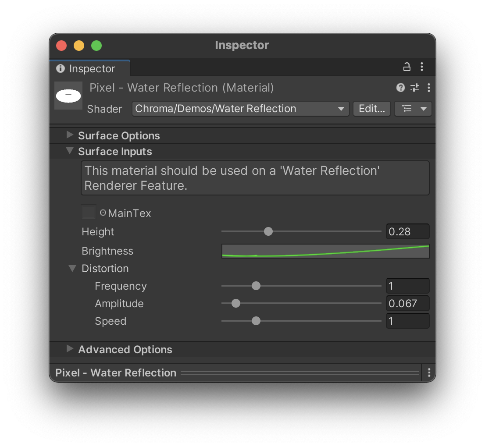
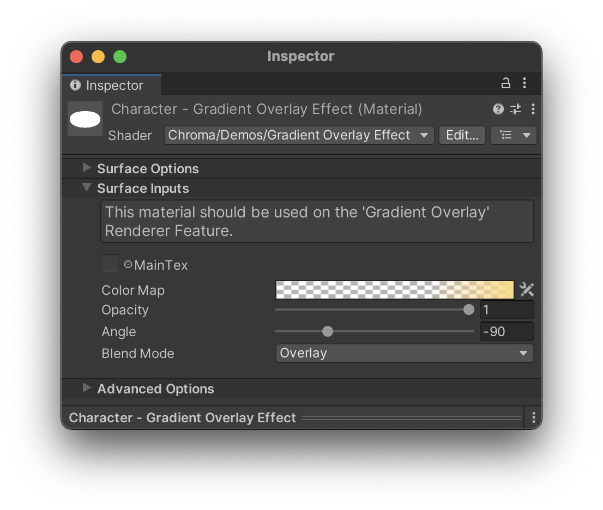

## Overview

Example shaders are the shaders that are made during the preparation of the [Chroma Demos](/demo-scenes/). We included them so that you can dissect them and learn how to use the features of Chroma. Also, they are already nicely featured and can be used as a starting point for your own shaders or already complete shaders for your projects. 

## Example Object Shaders

### Gradient Shading

A simple unlit gradient shader. It uses the Chroma's [`Gradient` node](/gradient/#adding-a-gradient-to-a-shader) to create a gradient. The point at which gradient is sampled is based on object normal and light direction.

{: .image-fancy}

### Simple Gradient

A simple lit gradient shader that uses the Chroma's [`Gradient` node](/gradient/#adding-a-gradient-to-a-shader) to create a gradient. The point at which gradient is sampled is based on object normal and light direction. Such a shader was built from scratch in [this video](/shader-graph-nodes/#adding-a-gradient-to-a-shader-graph).

### Height Gradient

A more advanced gradient shader with an option of the height gradient and its various parameters. _Blend Mode_ parameter is particularly useful here.

{: .image-fancy}

### Character

A shader that is used in the [Chroma Character](/demo-scenes/#character-scene) Demo. It has a similar feature set to the [Height Gradient](/example-shaders/#height-gradient) shader with an addition of the Displacement [Curve](/curve/).

{: .image-fancy}

### Fog Portal

A shader from the [Cave](/demo-scenes/#cave-scene) Demo scene. It is used for a particular effect for the portals in the cave, when upon approaching to them, they lower their opacity. The parameters can be set in many various combinations that greatly exceed the intended effect for this shader.

{: .image-fancy}

### Grass Plane

From the [Grass](/demo-scenes/#grass-plane-scene) Demo scene. A shader that is used on a simple custom plane mesh, which turned it into a grass-looking result. This shader is packed with various [Curve](/curves/) that control the main parameters in a non-linear way.

{: .image-fancy}

### Skybox

From most of the Demo scenes. A shader that is used for the skybox with a [Gradient](/gradient/#adding-a-gradient-to-a-shader) color input. 

{: .image-fancy}

## Example Image Effects

### Color Remap

From the [Pixel](/demo-scenes/#pixel-scene) and [Furniture](/demo-scenes/#furniture-scene) Demo scenes. With the gradient input, you can create a color remap effect.
This image effect (pictured below) was made as a Renderer Feature in URP and uses the material as an input (pictured above).

{: .image-fancy}

### Water Reflection

From the [Pixel](/demo-scenes/#pixel-scene) Demo scene. Made just for fun, to make the water look like a mirror, with options to make it less linear with _Brightness_ parameter and less static using the _Distortion_ parameters.
This image effect (pictured below) was made as a Renderer Feature in URP and uses the material as an input (pictured above).

{: .image-fancy}

### Gradient Overlay

The Gradient Overlay image effect, used in [Character](/demo-scenes/#character) demo scene.
This image effect (pictured below) was made as a Renderer Feature in URP and uses the material as an input (pictured above).

{: .image-fancy}