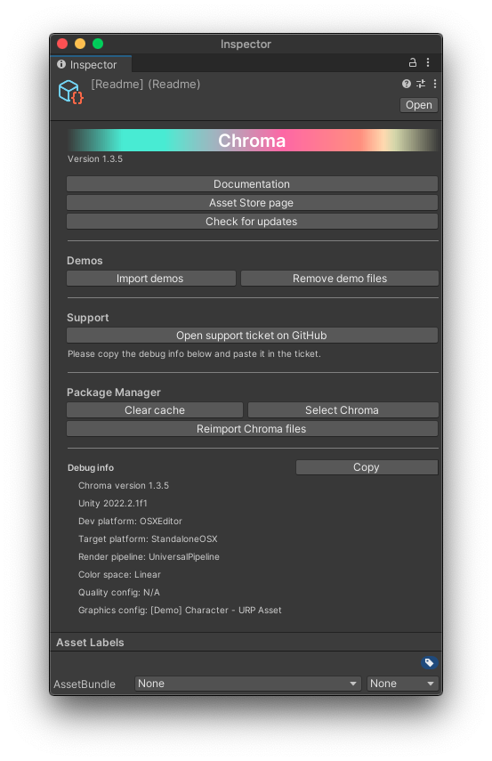

## Importing Chroma

<!--
<iframe width="560" height="315" src="https://www.youtube.com/embed/r0uKa10urQE" title="YouTube video player" frameborder="0" allow="accelerometer; autoplay; clipboard-write; encrypted-media; gyroscope; picture-in-picture" allowfullscreen></iframe>
-->

A guide on downloading, importing and setting up Chroma
{:.image-caption}

First of all, you need to import Chroma into your project.
<!--  -->

  * In Unity, go to **Window** ▶︎ **Package Manager**;
  * On the top left, please, find the **Packages** drop down menu. Select **My Assets** item there. You’ll find **Chroma** among your assets. Choose the version you’d like to import;
  * Click **Download** (if it is not downloaded yet);
  * Click **Import**.

## Quick Start Scene

The Quick Start scene is a good place to start if you are new to Chroma. It contains a few examples of the most common use cases for Chroma.

The Quick Start scene scene works in all Render Pipelines: Built-in, URP and HDRP.
{:.notice--info}

{: .image-fancy}

[More info about the Quick Start Scene](/demo-scenes/#quick-start-scene)

## Troubleshooting

Below you can find typical possible issues when installing Chroma as well as other assets in Unity.

#### Can't import Chroma
- First of all, please, make sure you downloaded Chroma using the _Package Manager_.
- If the 'Import' button is greyed out, it may be due to the known Package Manager 'cache' issue. Here is how to fix it:
  1. Please, locate the **Readme** helper tool:
**Project** panel ▶︎ **Assets** folder ▶︎ **Chroma** folder ▶︎ select **Readme** and go to _Inspector_ panel;
  1. Press **Clear Cache**;
  1. Download and import Chroma from the _Package Manager_ or using _Reimport Chroma files_ button on the **Readme** file's Inspector panel.

  

  {:.image-caption}
  Readme file interface

#### After importing, Chroma gives errors
- First, try **restarting Unity**. A simple restart indeed sometimes fixes some strange issues.
- **Re-import Chroma**. Here is how:
  1. Please, locate the **Readme** helper tool:
**Project** panel ▶︎ **Assets** folder ▶︎ **Chroma** folder ▶︎ select **Readme** and go to _Inspector_ panel;
  1. Press **Clear Cache**;
  1. Delete the **Chroma** folder from the **Project** panel ▶︎ **Assets** folder;
  1. Download and import Chroma from the _Package Manager_ or using _Reimport Chroma files_ button on the **Readme** file's Inspector panel.
- Verify if the Unity version is equal or is newer than **2020.3.30f1**.
- Make sure that you are not using a Unity **beta** release.
- If nothing helps, please, write to info@dustyroom.com and include the copied debug info from the **Readme** file, which is by default located in **Assets** folder ▶︎ **Chroma** folder (or just share a screenshot of the panel).

#### After importing, some of the shaders are missing or cannot be compiled
- Check whether your setup meets the [requirements](/limitations).
- Try a complete reimport for Chroma. [Here's how](#after-importing-chroma-gives-errors)
