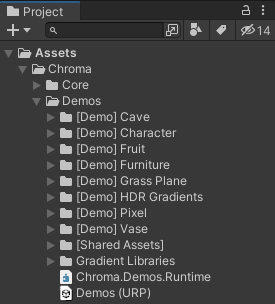
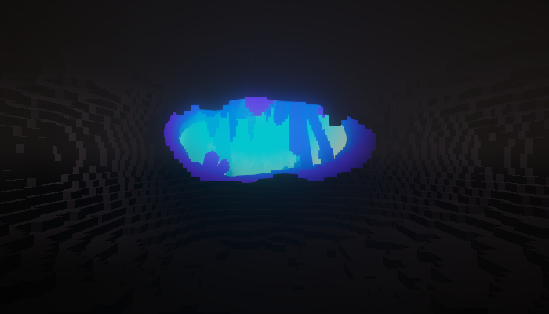
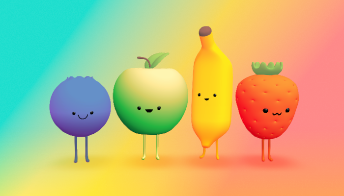
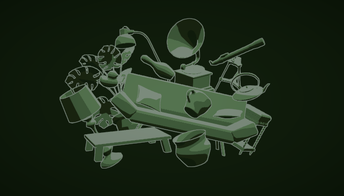
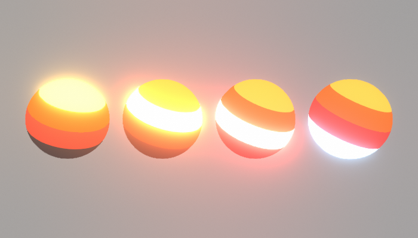
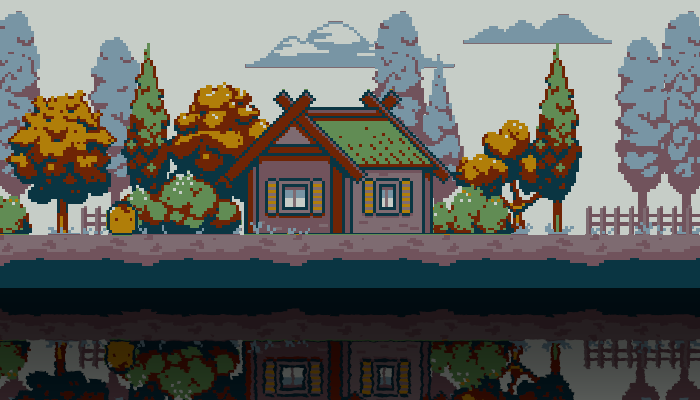
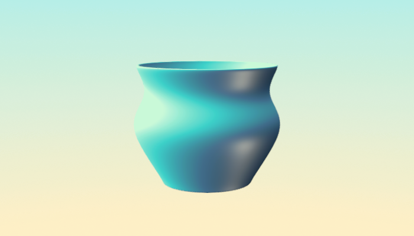

In the scenes we tried to showcase a variety of use cases for the Chroma features: shaders, ramps, gradients etc.

The Demo scenes are in _Linear Color Space_. If you use open Chroma Demo Scenes in _Gamma Color Space_, the scenes will look differently.
{: .notice--warning}

The scenes can be found in:
_**Project** panel ▶︎ **Assets** folder ▶︎ **Chroma** folder ▶︎ **Demos** folder_

{: .image-fancy}

{:.image-caption}
Path to the Demo Scenes included in Chroma

#### Quick Start Scene

The Quick Start scene is a good place to start if you are new to Chroma. It contains a few examples of the most common use cases for Chroma.

The Quick Start scene scene works in all Render Pipelines: Built-in, URP and HDRP.
{: .notice--info}

There is two shaders used in the scene:
- **Object shader** - a Shader Graph example that can be used for any object in the scene. It has a few parameters that can be tweaked in the Inspector;
- **Skybox shader** - a code-based shader that can be used as a Skybox. It has a few parameters that can be tweaked in the Inspector.

{: .image-fancy}

---

The demo scenes below use Universal RP but Chroma components work in _Universal RP_, _HDRP_ and _Built-In RP_, both in _Shader Graph_ and _hand-written shaders_.
{: .notice--warning}

Each of the scenes has its own URP Asset file loaded using a special script on the Camera. This way it is easy to add and modify the scenes without need to add Renderers in the wotherwise global URP Asset file.
{: .notice--info}

---

#### Cave Scene
In this scene you can see an example shader in form of a Fog Portal. It reacts and changes its behavior depending on the camera position There is a light beam made with the same shader in this scene.

{: .image-fancy}

#### Character Scene
A scene showing a collection of gradients. In this scene some of the materials use height gradients in combination with regular albedo gradients. Among the parameters you can find a useful Blending Mode menu for even more stylistic choices.

{: .image-fancy}

#### Fruit Scene
A scene with gradients taken from palette generator websites.

{: .image-fancy}

#### Furniture Scene
A barebone black and white scene with a colorful Color Remap material on top, resulting in a sleek display. The material is set in the Renderer Feature inside the scene's Renderer.

{: .image-fancy}

#### Grass Plane Scene
In this scene you can find a simple plane with a single material responsible for a grass effect with all the essential parameters. This scene was designed as a showcase for the Curves.

{: .image-fancy}

#### HDR Gradient Scene
This scene shows the HDR quality of the Chroma Gradient. A sphere has a material with a gradient with several color stops. Each of these stops is sequentially turned into HDR, while other ones stay in LDR. This scene utilizes a Bloom override in the _Volume_ camera Component.

{: .image-fancy}

#### Pixel Scene
A monochrome 2D scene with a _Color Remap_ material applied on top, resulting in a colorful look. You can find the selection of gradient presets in Chroma made for this scene.

{: .image-fancy}

#### Vase Scene
A simple scene with an elegant gradient.

{: .image-fancy}
