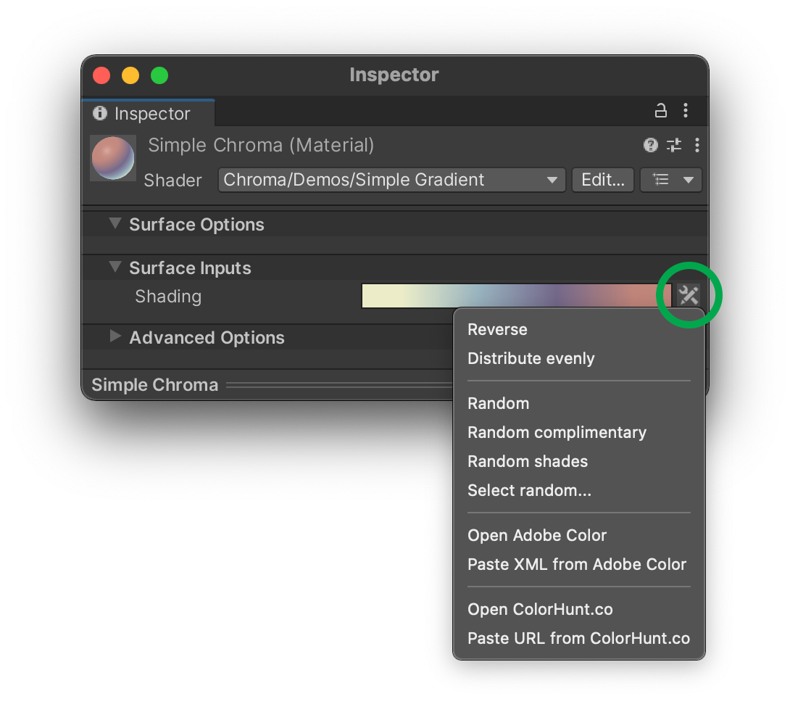

## Gradient Brief Overview
_Gradient_ is a shader parameter that allows you to create a smooth or stepped transition between two or more colors. It's a great way to add some visual interest to your materials.

_Gradients are useful in virutally any shader_. For example, let's say you're creating a terrain shader that changes color depending on the height of the surface. You can use a gradient to smoothly transition between colors as the height changes. You can use the alpha channel of the gradient to control the impact of normals on shading and boom, you have the "Monument Valley" look in your game.

We've also seen gradients used in shaders that control the color of a fire, the color of a water surface, the color of a sky, the color of a fog, and so on. The possibilities are endless. Some of these examples are included in the [Chroma Demos](/demo-scenes/).

## HDR Gradients
Often you need to use gradients in HDR lighting. For example, you might want to create a gradient that controls the color of a fire. In this case, you need to use an HDR gradient. HDR gradients are gradients that use HDR colors. This means that the colors in the gradient can have a value greater than 1.0.

To create an HDR gradient, you need to add a `Gradient(HDR)` property to your shader.

For an example of an HDR Gradient, please load the _HDR Gradient Demo Scene_ located in _Assets/Chroma/Demos_.
{: .notice--info}

<iframe src="https://player.vimeo.com/video/756448759?h=5ed5c5ca0a" width="640" height="450" frameborder="0" allow="autoplay; fullscreen" allowfullscreen></iframe>

## Adding a Gradient to a Shader

For a detailed example of how to use gradients in shaders, please refer to the following pages:
- [Use in Shader Graph](/shader-graph-nodes/)
- [Use in Code Shaders](/code-shader-macros/)

## Gradient Inspector

Chroma adds a Gradient Inspector to the Material Inspector window. The Gradient Inspector consists of two parts - Gradient Editor and a context menu.

### Gradient Editor
The Gradient Editor is a tool that allows you to create and edit gradients. It's a part of the Gradient parameter in the Inspector.

Clicking on an icon of the _Gradient_ opens the _Gradient Editor_ where you can freely add up to eight individual independent color _breakpoints_ (color stops) and move them across the ramp. The layout of the colors on the _breakpoints_ corresponds to the layout of the colors on the scene object the material is applied to. When you move the _breakpoint_ or change the color values in _Gradient Editor_, the shading changes on the affected object(s) simultaneously, **in real time**. It is extremely useful for fine-tuning the color positions on the object. Also, it works for the models that have no UV maps.

<!--

{:.image-caption}
Gradient Editor is real-time
-->

**TIP.** Whenever you make up an interesting gradient in the Gradient Editor, you can save it by pressing the ‘New’ button in the ramp presets section of the Gradient Editor. This adds an icon of the gradient to the collection, which is really useful if you want to quickly preview different possible gradients.

*Using presets in the Gradient Editor*
{: .notice--info}

There are ‘smooth’ and ‘fixed’ color gradations in the Gradient editor. You can have a sharp transition from one color to another by selecting a _Fixed_ mode (using 1 color stop). If you select _Smooth_ mode, the transition from color band to the adjacent one will be gradual. See the pictures below.

{:.image-caption}
*Gradient Editor in Fixed mode — the color bands have distinct boundaries*

{:.image-caption}
*Gradient Editor in Blend mode — the color bands have gradual boundaries*

In _Smooth_ mode you can set all or some of the color stops closely to the adjacent ones to make a stepped (reminiscent of _Fixed_ mode) or partially stepped / partially smooth gradient.

{:.image-caption}
Gradient Editor in Blend mode with partially tight color stops

Please, note that if you would like to get a smooth gradient, your model should have smooth normals. Otherwise, even if you have the _Blend_ mode chosen, but you have a model with hard normals, you'll likely see a stepped gradient. If you have no option to edit a model, you can try adjusting the parameters in the model's _Import Settings_
{: .notice--warning}

#### Presets
**TIP.** Whenever you make up an interesting gradient in the Gradient Editor, you can save it by pressing the ‘New’ button in the ramp presets section of the Gradient Editor. This adds an icon of the gradient to the collection, which is really useful if you want to quickly preview different possible gradients.  
{: .image-simple}

{: .notice--info}
Using presets in the _Gradient Editor_

### Gradient Context Menu

In the _Inspector_ panel, next to the _Gradient Editor_ thumbnail, you can find the **Chroma context menu**. It has a few useful operations listed that make the gradient editing and randomization easy.

{:.image-caption}
*Gradient context menu*

#### Randomization
You can create random gradients by using the _Random_ and _Random complimentary_ buttons in a gradient's context menu. The _Random_ button creates a gradient with 4 random colors that go well together. The _Random complimentary_ button creates a gradient with random colors that are complimentary (opposite) to each other.

{: .image-fancy}

{:.image-caption}
#### [Adobe Color](https://color.adobe.com/) Integration
Chroma integrates with Adobe Color, a popular color scheme generator. You can use it to create gradients and then import them into your material.

<iframe src="https://player.vimeo.com/video/756448695?h=a24cf3ee03" width="640" height="450" frameborder="0" allow="autoplay; fullscreen" allowfullscreen></iframe>

#### [ColorHunt.co](https://colorhunt.co/) Integration
ColorHunt.co is a great resource for finding color palettes. You can easily import a color palette from ColorHunt.co right into Unity shader UI that uses Chroma.

<iframe src="https://player.vimeo.com/video/756448162?h=a21c39840d" width="640" height="450" frameborder="0" allow="autoplay; fullscreen" allowfullscreen></iframe>

